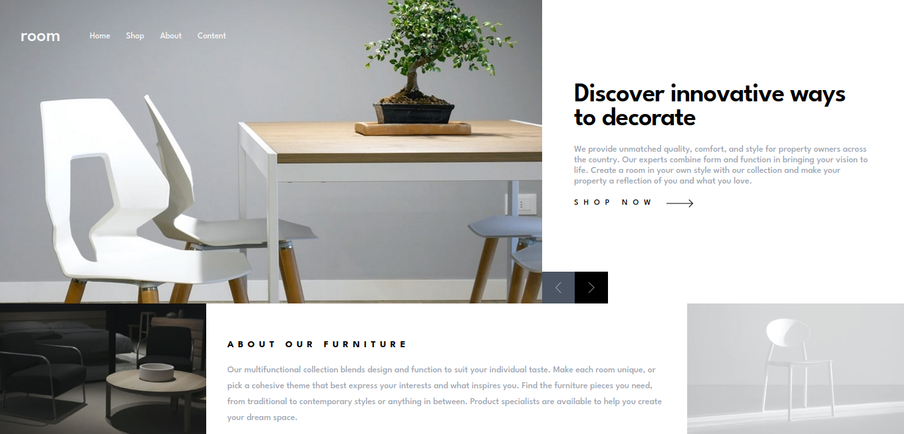

# Frontend Mentor - Room homepage solution

This is a solution to the [Room homepage challenge on Frontend Mentor](https://www.frontendmentor.io/challenges/room-homepage-BtdBY_ENq).

## Table of contents

- [Overview](#overview)
  - [The challenge](#the-challenge)
  - [Screenshot](#screenshot)
  - [Links](#links)
- [My process](#my-process)
  - [Built with](#built-with)
  - [What I learned](#what-i-learned)
  - [Continued development](#continued-development)
- [Author](#author)

## Overview

### The challenge

Users should be able to:

- View the optimal layout for the site depending on their device's screen size
- See hover states for all interactive elements on the page
- Navigate the slider using either their mouse/trackpad or keyboard

### Screenshot

### Links

- Live Site URL: [Live Site URL](https://room-homepg-frontendmentor.netlify.app/)

## My process

- Mobile-first approach; structure first, UI concerns later, and interactivity at last, using Svelte and JSDoc.

### Built with

- [Svelte](https://svelte.dev/)
- [SvelteKit](https://kit.svelte.dev/)
- [TailwindCSS](https://tailwindcss.com/)
- [JSDoc](https://jsdoc.app/)
- CSS Flexbox
- CSS Grid
- CSS Animations
- Mobile-first workflow

### What I learned

For the first time, I used CSS animations in a project; succesfully did so on the mobile menu navigation bar; tried to use it to create a smooth transition to the slider, but ended up not being able to do so up until now.
Got to use JSDoc for type annotations; no fancy build and compilation steps for type hints, like when using TypeScript.

### Continued development

I intend on sharpening my CSS animations/transitions skills; struggled a bit to create a slider effect using pure CSS. I also intend on continue to use Svelte and JSDoc; Svelte its being a nice alternative to ReactJS, and JSDoc a nice alternative to TypeScript.
I also have to improve my accessility and performance notions.

## Author

- Frontend Mentor - [@JoramirJr](https://www.frontendmentor.io/profile/JoramirJr)
